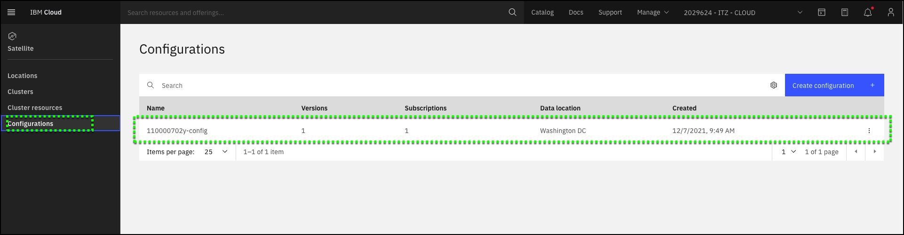

**Configurations** allow you to upload or create Kubernetes resource YAML file **versions** that you want to deploy to one or more Red Hat OpenShift clusters. Once you create **versions**, the Kubernetes resources can be deployed by adding a **subscription** to your **configuration**. The **subscription** specifies the **version** to be deployed and the target **cluster group(s)**.

In this demonstration environment, a **configuration** has already been created for you.

1. If you closed the IBM Cloud portal after the previous step, open the IBM Cloud portal to the Satellite Clusters page: <a href="https://cloud.ibm.com/satellite/configuration" target="_blank">https://cloud.ibm.com/satellite/configuration</a>

2. Verify your **Configuration** is created.

!!! info "Important"
    The image below will show a different configuration name.  Find your **configuration** based upon your IBMid (**#######abc-ns**).

