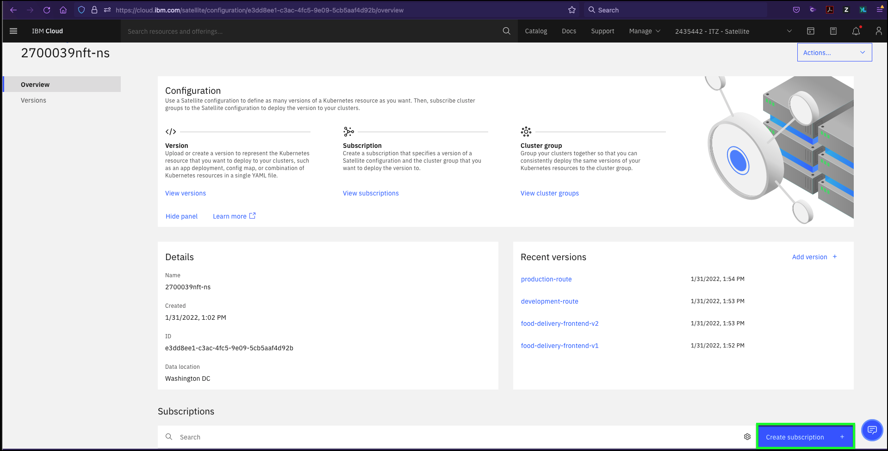
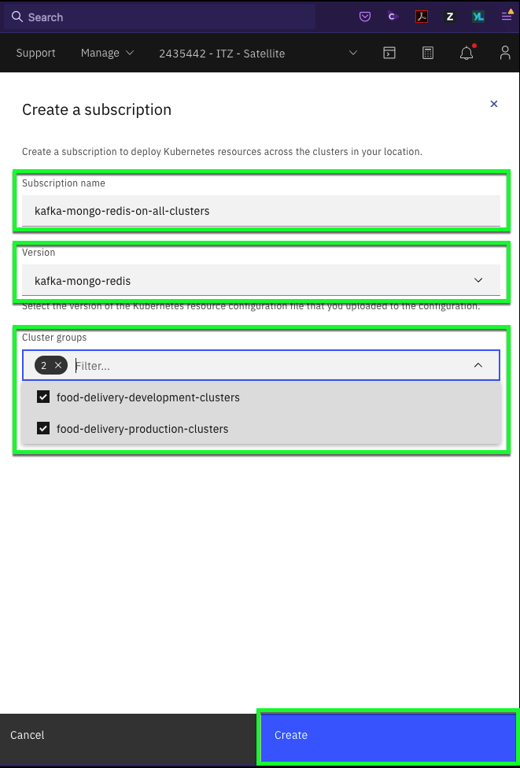
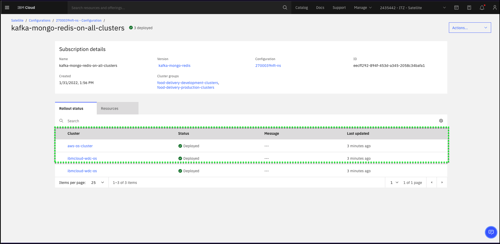
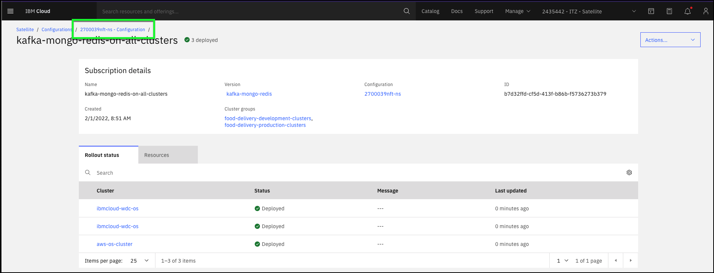

Now that the Configuration and Versions have been created, the next step is to create **subscriptions** for the Food Delivery application. In total, six **subscriptions** will be created:


|**Subscription name**              | **Version**               | **Cluster group(s)**               |
|-----------------------------------|---------------------------|------------------------------------|
| kafka-mongo-redis-on-all-clusters | kafka-mongo-redis         | food-delivery-production-clusters<br>food-delivery-development-clusters|
| backend-on-all-clusters           | food-delivery-backend     | food-delivery-production-clusters<br>food-delivery-development-clusters|
| frontend-on-dev-clusters          | food-delivery-frontend-v1 | food-delivery-development-clusters |
| frontend-on-prod-clusters         | food-delivery-frontend-v1 | food-delivery-production-clusters  |
| route-dev                         | development-route         | food-delivery-development-clusters |
| route-prod                        | production-route          | food-delivery-production-clusters  |

These **subscriptions** will use the **versions** you created to deploy the code to the selected OpenShift clusters.

1. If you closed the IBM Cloud portal after the previous step, open the IBM Cloud portal to the Satellite Configurations page: <a href="https://cloud.ibm.com/satellite/configuration" target="_blank">https://cloud.ibm.com/satellite/configuration</a>.

2. Click the the configuration based upon your **{{ tz_environment.uuid_label }}**


3. Click the **Create subscription +** button on the Overview page under Subscriptions.



!!! Danger
    Do NOT delete any existing subscriptions! These are used to create the OpenShift namespace you will be using in this demonstration. Deleting them will break the demonstration.

4. Create the **kafka-mongo-redis-on-all-clusters** subscription.

Use the following values for the **Create a subscription** dialog:

**Subscription name**
```
kafka-mongo-redis-on-all-clusters
```
**Version**
```
kafka-mongo-redis
```
**Cluster groups**
```
food-delivery-production-clusters
food-delivery-development-clusters
```



5. Click **Create** for the **kafka-mongo-redis-on-all-clusters** subscription.

6. Verify the **kafka-mongo-redis-on-all-clusters** is created and deployed.

Immediately after clicking create, notice the new Subscription appears in the **Subscriptions** table.
Initially, the **Rollout status** shows **---**. After a few seconds, this should change to **2 deployed**.


!!! failure
    If the status doesn't update automatically, click the page refresh button of your browser.

7. Click the **kafka-mongo-redis-on-all-clusters** entry in the table and view the Subscription details.



!!! Note
    In some circumstances, you may see more than 2 entries in the details section. As long as you have a successful deployment to both {{ aws.cluster_name }} and {{ ibm.cluster_name }}, you can continue. If one or more of the deployments fail, you need to verify the versions created in the previous step are correct. Make sure you successful replace all instances of **#######abc-ns** with your **{{ tz_environment.uuid_label }}**.

8. Click your **configuration** link to return to the configuration page.



9. Repeat the above process (steps 3 thru 8) for each of the remaining subscriptions.

|**Subscription Name**                    | **Version**               | **Cluster group(s)**                 |
|----------------------------|---------------------------|--------------------------------------|
| backend-on-all-clusters    | food-delivery-backend     | food-delivery-production-clusters <br>food-delivery-development-clusters |
| frontend-on-dev-clusters   | food-delivery-frontend-v1 |  food-delivery-development-clusters  |
| frontend-on-prod-clusters  | food-delivery-frontend-v1 |  food-delivery-production-clusters   |
| route-dev                  | development-route         |  food-delivery-development-clusters  |
| route-prod                 | production-route          |  food-delivery-production-clusters   |

To avoid typographical errors, use the  to copy the values below and paste into the **Subscription name** field.
```
backend-on-all-clusters
```

```
frontend-on-dev-clusters
```

```
frontend-on-prod-clusters
```

```
route-dev
```

```
route-prod
```

10. Verify all **Subscriptions** are created and deployed.


!!! info
    In the next step you will access the Red Hat OpenShift portal to further verify the application has been deployed. You will also access the application and make updates to it using the **food-delivery-frontend-v2** version.
