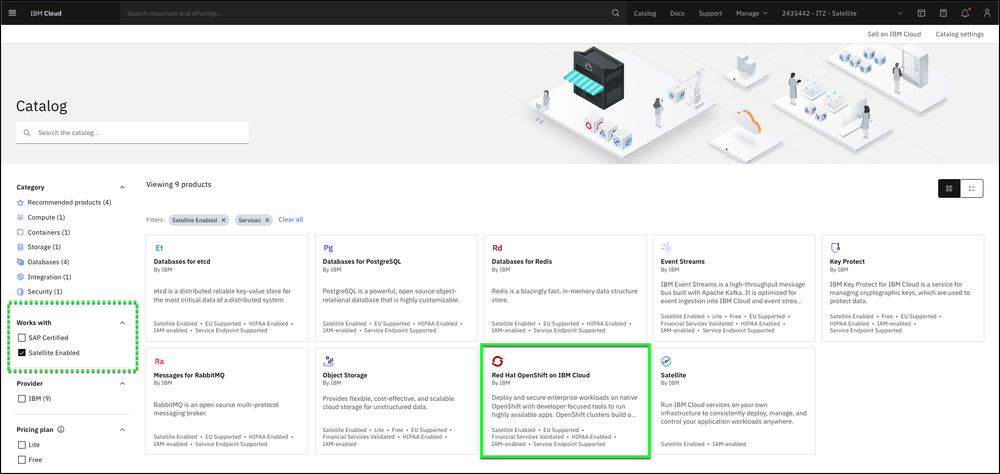

Demonstrating how to provision an IBM Cloud Satellite enabled service may be of interest to some audiences, but this activity is typically done only a couple of times by a client and is usually performed by their technical team. This demonstration does not illustrate the real business value of IBM Cloud Satellite. It is included in this asset for completeness. If you have limited time to perform a live demonstration, you may want to briefly cover this process and move on to some of the other demonstrations described in later parts of the demonstration script.

There are several approaches you can take in doing an actual demonstration of the provisioning process of a Satellite enabled IBM Cloud service.

1. Play the video in the previous chapter to the client. It includes both narration and annotations.
2. Use the raw video (below) from the previous chapter and provide your own narration to the video. You will want to pause the video at appropriate locations based upon your narration and any questions your client may have.

!!! info
    This video has no sound and is intended to be played while you narrate. Also, the IBM Cloud portal and the IB Cloud Satellite product changes regularly. You may notice some differences between the video and the actual user interface and experience you see today.

    

    **Note:** If the video appears blurry, click the fullscreen  or  icon.

3. Alternatively, you could also do this demonstration using the IBM Cloud portal up to the point of clicking the "Create" button. Then switch to the already provisioned cluster and describe what took place during the provisioning process. This "baking show" approach shows all the steps, but avoids the delays that would be required to perform the provisioning of resources.

The steps below can be used as a guide for this style of demonstration:

1. Launch the IBM Cloud portal to the Satellite enabled catalog page: <a href="https://cloud.ibm.com/catalog?search=label%3Asatellite_enabled" target="_blank">https://cloud.ibm.com/catalog?search=label%3Asatellite_enabled</a>.

!!! tip
    The IBM Cloud Portal will be opened in a new browser tab. You need to switch between this tab and the new tab to accomplish many of the tasks. You may want to open the new ta in a new window and display both browser windows at the same time. You may need to disable pop-up blockers if you do not see the new tab. Also, Firefox and Safari browsers are recommended as the image quality of screen captures when viewed in Chrome are sub-optimum.

Sample dialog:

2. If you haven't already, change from your IBM Cloud account to the demonstration IBM Cloud account: **{{ account }}***.

!!! tip
    If your browser window is narrow, you may see this icon:  instead of the current account name as shown in the screen capture above.

3. Click the **Red Hat OpenShift on IBM Cloud** tile.

Sample dialog:

4. Select the **Satellite** tile under the **Infrastructure** section.

Sample dialog:

5. In the **Location** section, select the **{{ aws.location }}** location in the table.

Sample dialog:

6. Change cluster name to {{ aws.cluster_name }}.

!!! info "Important"
    By the time you specify a name, the **Create** button at the far right of the portal would typically be enabled.  Since you do not have the appropriate permissions in this account to create a new cluster, the button remains disabled.  Now is the time to explain how happens if you were to click create.

Sample dialog:

7. Click the  menu and select **Satellite->Clusters**.

8. Click the **{{ aws.cluster_name }} in the **Clusters** table.

Sample dialog:

9. Time to wrap up this part of the demonstration.

Sample dialog:
