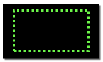

**Helpful tips for using this demonstration environment**

Labs and demonstrations are composed of exercises/chapters which guide you through a particular topic or function. Each exercise is composed of numbered steps, which are typically actions that you will perform either using the terminal that is part of the browser-based lab environment or in another browser window or tab.

Throughout the lab, you will see images that are examples of what you should be seeing during the step. In some instances, you will see the following styles of highlighting in those images:

- Action highlight box: Illustrates where you should click,  enter, or select an item:

- Path/explore highlight box: Illustrates one of two things:
  - the path to follow to get to a specific location in the user interface
  - areas to explore on your own
  

- Copy to clipboard box: Text that is copied to your clipboard. Click the copy icon (highlighted below) and then paste using your operating systems paste function. For example, entering <control>+v or right click and select paste.

